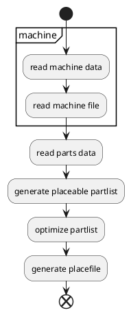

# Important info  
At the moment i focus on using Eagle mount files for the script and a csv file for the machine data.

# Neoden YY1 CSV Generator  
Goal of this Pyton script should be to generate the csv file for a Neoden YY1 Pick and Place machine.  
TO reach the goal the idea is to have a csv file with all the parts that are one the machine.  
The script will then do the following steps:  
- read all the parts in from the mount file (at the moment Eagle)  
- read all the parts from the machine file  
- check which componets are on the machine and which are required  
- generate the csv file for yy1 machine  

## Workflow  


# machine.csv  
This file contains all the components of the parts on the yy1 machine:  
- id: feeder id where the part is located  
- part_name: Name of the part  
- part_value = Vakue of the part  
- part_package = package of the part  
- part_height = hight of the part  
- part_nozzle = Nozzle name that should be used  
- part_speed = Speed in percet for placing the part  
- part_mode = Placement mode for the part  
- part_comment = Free comment filed

# Generator  

# Placement list
All Parts and the placement data should be in a comma separated file.  
For Fusion 360 there is a ulp inside of the repo.  

## Example of the file  
Name, Value, Package, xpos, ypos, angle
```
R1,20k,C0805,12.05,08.65,90
```
## verify parts agains machine parts  
to place the correct parts on the board some variables should be compared to place the right parts  
- part_name: is it a **R**esistor or a **C**apacitor  
- part_value: is it the right value 10k  
- part_package: is it the right package **0805** or **1205**