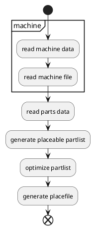

# Neoden YY1 CSV Generator

This Python project generates a placement CSV file for the Neoden YY1 Pick and Place machine. It takes a mount file (e.g., from Eagle or Fusion 360) and a machine configuration CSV, matches the required parts with the available feeders, and outputs a ready-to-use file for the YY1.

## Features

- Reads parts from a mount file (Eagle/Fusion 360)
- Reads machine configuration from a CSV file
- Checks which components are available on the machine and which are required for the project
- Generates a placement CSV file for the YY1
- Reports parts that cannot be placed

## Usage

Python 3 is required. No external dependencies.

```sh
python main.py --file <mountfile.mnt> --machine <machine.csv>
```

Example:

```sh
python main.py --file "project.mnt" --machine "machine.csv"
```

The generated file will be placed in the `output/` directory.

## Workflow



## machine.csv Format

| id | part_name | part_value | part_package | part_height | part_nozzle | part_speed | part_mode | part_comment |
|----|-----------|------------|--------------|-------------|-------------|------------|-----------|-------------|
| 1  | resistor  | 10k        | R0805        | 1.5         | 1           | 80         | 1         | optional     |

- **id**: Feeder ID
- **part_name**: Part type (e.g., resistor, capacitor)
- **part_value**: Value (e.g., 10k)
- **part_package**: Package (e.g., R0805)
- **part_height**: Height in mm
- **part_nozzle**: Nozzle number
- **part_speed**: Placement speed (%)
- **part_mode**: Placement mode
- **part_comment**: Free comment

## Mount File Example (Eagle/Fusion 360)

```
R1,20k,C0805,12.05,08.65,90
```

| Name | Value | Package | xpos | ypos | angle |
|------|-------|---------|------|------|-------|

## Part Matching

To ensure correct placement, the following fields are compared:

- **part_name**: e.g., R (resistor) or C (capacitor)
- **part_value**: e.g., 10k
- **part_package**: e.g., 0805, 1206

## Additional Info

- Parts not available on the machine are listed in the output.
- For Fusion 360, a ULP script for export is included in the repo.

---

Feel free to contribute or open an issue if you have questions or suggestions!